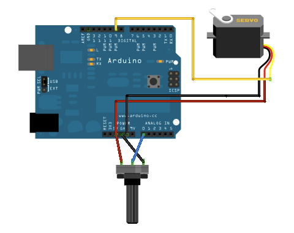
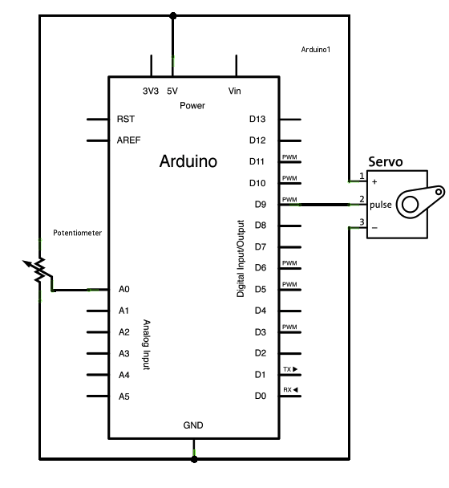

# Knob

Control the position of an RC (hobby) [servo motor](http://en.wikipedia.org/wiki/Servo_motor#RC_servos) with your Arduino and a potentiometer.

This example makes use of the Arduino `Servo` library.

## Hardware Required

* an Arduino board
* Servo motor
* 10k ohm potentiometer
* hook-up wires

## Circuit

Servo motors have three wires: power, ground, and signal. The power wire is typically red, and should be connected to the 5V pin on the Arduino board. The ground wire is typically black or brown and should be connected to a ground pin on the board. The signal pin is typically yellow or orange and should be connected to pin 9 on the board.

The potentiometer should be wired so that its two outer pins are connected to power (5V) and ground, and its middle pin is connected to analog input 0 on the board.

(Images developed using Fritzing. For more circuit examples, see the [Fritzing project page](http://fritzing.org/projects/))

## Schematic

## See also

* [attach()](/docs/api.md#attach)
* [write()](/docs/api.md#write)
* [map()](https://www.arduino.cc/en/Reference/Map)
* [analogRead()](https://www.arduino.cc/en/Reference/AnalogRead)
* [Servo library reference](/docs/readme.md)
* [Sweep](../Sweep) - Sweep the shaft of a servo motor back and forth
