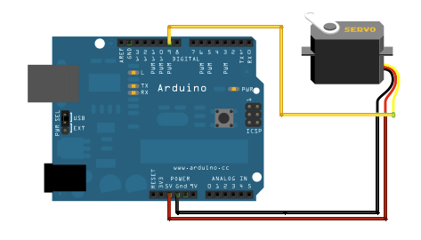

# Sweep

Sweeps the shaft of a RC [servo motor](http://en.wikipedia.org/wiki/Servo_motor#RC_servos) back and forth across 180 degrees.

## Hardware Required

* Arduino Board
* Servo Motor
* Hook-up wires

## Circuit

Servo motors have three wires: power, ground, and signal. The power wire is typically red, and should be connected to the 5V pin on the Arduino or Genuino board. The ground wire is typically black or brown and should be connected to a ground pin on the board. The signal pin is typically yellow, orange or white and should be connected to pin 9 on the board.

(Images developed using Fritzing. For more circuit examples, see the [Fritzing project page](http://fritzing.org/projects/))

## Schematic

## See also

* [attach()](/docs/api.md#attach)
* [write()](/docs/api.md#write)
* [map()](https://www.arduino.cc/en/Reference/Map)
* [Servo library reference](/docs/readme.md)
* [Knob](../Knob) - Sweep the shaft of a servo motor back and forth
